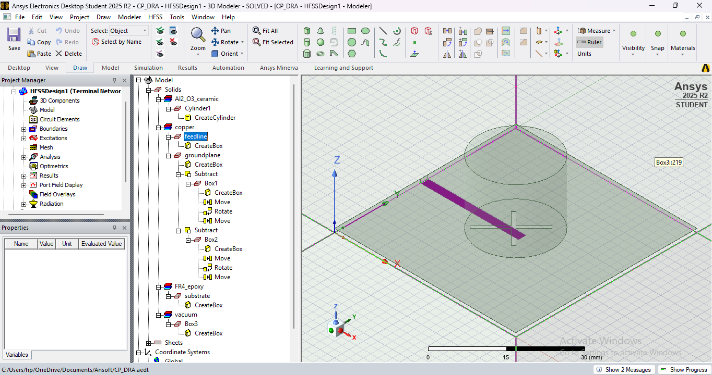
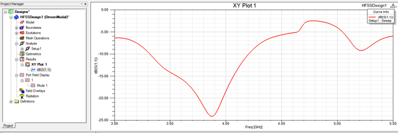
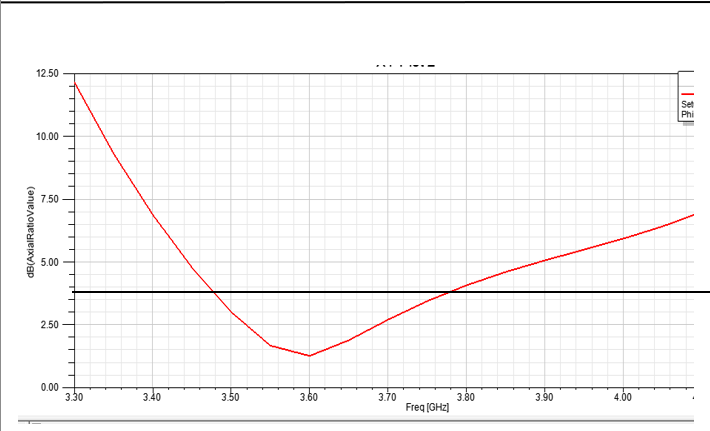
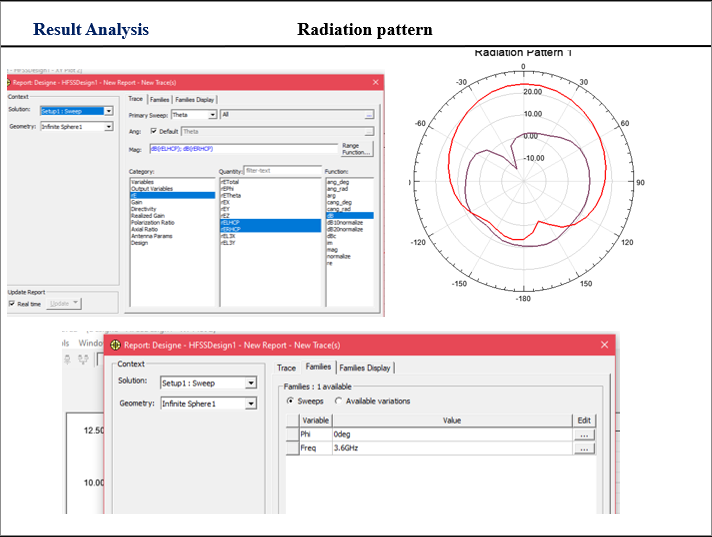

# 📡 Circularly Polarized Dielectric Resonator Antenna (CP-DRA) Using HFSS

## 📖 Overview

This project presents the design and simulation of a **Circularly Polarized Dielectric Resonator Antenna (CP-DRA)** using **Ansys HFSS 2025 R2**. The antenna employs a **cross-slot feeding mechanism** to generate circular polarization and achieve improved radiation performance.

The design was analyzed in terms of **Return Loss (S11), Axial Ratio, VSWR, Bandwidth, Gain, and Radiation Pattern**. The obtained results demonstrate good impedance matching and effective circular polarization suitable for wireless and satellite communication applications.

---

## 🎯 Objectives

* Design a Circularly Polarized Dielectric Resonator Antenna (CP-DRA)
* Generate circular polarization using a cross-slot feed
* Analyze Return Loss (S11)
* Evaluate Axial Ratio performance
* Study Radiation Characteristics
* Determine Gain, VSWR, and Bandwidth

---

## 🛠 Software Used

* Ansys HFSS 2025 R2
* Electromagnetic Simulation (FEM-Based Analysis)

---

## 🏗 Antenna Components

The antenna structure consists of:

1. Substrate (FR4 Epoxy)
2. Ground Plane
3. Microstrip Feed Line
4. Cross Slot
5. Dielectric Resonator (Al₂O₃ Ceramic)
6. Radiation Boundary
7. Wave Port Excitation

---

## 🔄 Design Methodology

1. Create Substrate
2. Design Ground Plane
3. Create Feed Line
4. Design Cross Slot
5. Create Dielectric Resonator
6. Apply Radiation Boundary
7. Assign Port Excitation
8. Run Simulation
9. Analyze Results

---

## 📷 Antenna Geometry

---

## 📊 Simulation Results

### S11 (Return Loss)

### Axial Ratio

### Radiation Pattern

---

## 📈 Performance Summary

| Parameter          | Value     |
| ------------------ | --------- |
| Resonant Frequency | 3.88 GHz  |
| Return Loss (S11)  | -24 dB    |
| Axial Ratio        | 1.2 dB    |
| VSWR               | 1.13      |
| Bandwidth          | 500 MHz   |
| Gain               | ≈ 5.5 dBi |

---

## 🔍 Key Observations

* The antenna resonates at approximately **3.88 GHz**.
* A minimum **S11 of -24 dB** indicates excellent impedance matching.
* The **Axial Ratio of 1.2 dB** confirms successful circular polarization.
* The antenna exhibits a directional radiation pattern with broadside radiation.
* A bandwidth of approximately **500 MHz** was achieved.
* The design demonstrates good radiation performance for RF communication systems.

---

## 🚀 Applications

* Satellite Communication
* GPS Systems
* Wireless Communication
* 5G Communication Systems
* Radar Systems
* Aerospace Communication

---

## 🔮 Future Scope

* Gain Enhancement Techniques
* Bandwidth Optimization
* Antenna Array Design
* 5G and Beyond Wireless Applications
* Fabrication and Experimental Validation

---

## 💡 Skills Demonstrated

* Antenna Design
* RF Engineering
* Electromagnetic Simulation
* Circular Polarization Techniques
* HFSS Modeling
* Radiation Pattern Analysis
* Technical Documentation

---

## 📄 Project Report

The complete project report is available in this repository:

📁 **Project_Report.pdf**

---

## 👩‍💻 Author

**Stuti Pandey**

B.E. Electronics and Communication Engineering

Institute of Technology and Management, Gwalior

GitHub: https://github.com/CodeAlchemist2005

---

## ⭐ If you found this project useful, consider giving it a star!
